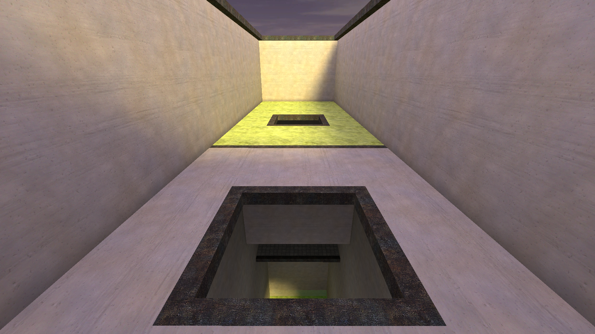

# rj_abandon

jump_abandon ported to Momentum Mod

## Changelog

### RC1

- Fully ported to Momentum Mod
  - Switched triggers to use `trigger_momentum_teleport`
  - Deleted various unused point entites, like class filters, health logic timer, damage filters
  - Switched cap point to Momentum cap point
  - Added zones
- Fixed being able to triple sync on last
- Fixed edgebug on 2nd last
- Improved/Increased lighting
  - cubemaps & increased ambient lighting
